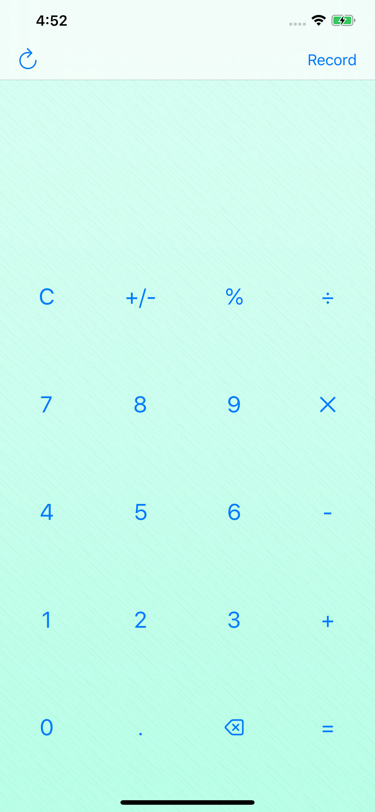

# Calculator - Modern & Simple
Link to App Store: https://apps.apple.com/us/app/calculator-modern-simple/id1478925335?ls=1

     

- A user can check all of his/her calculation history.

- A user can swipe left to delete his/her calculation history.

- Delete all calculation history by tapping trach icon at top right corner.

- Display will show you up to 6 lines of your current calculation, and your actual calculation can go more than 6 lines, just type as much as you want, and it will calculate just fine!

- I used following components to build this app: MVC design pattern, Realm database and Cocoapods.
